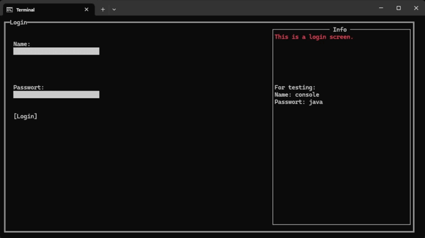
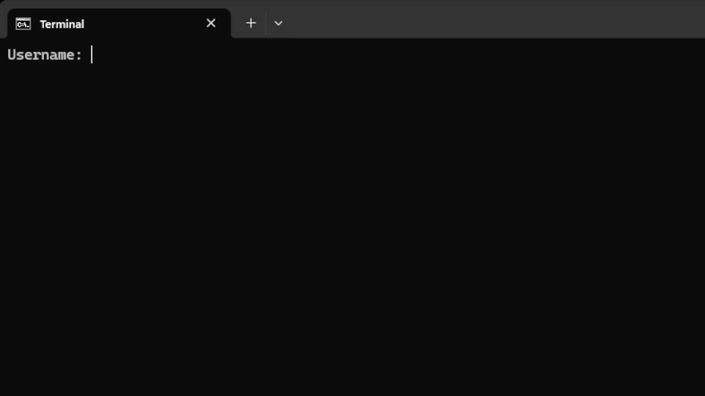

# JTerminal
A library to create smart console applications like commandline systems and user-interfaces.

## Showcase

[Source Code](jterminal-ui/src/test/java/net/jterminal/test/example)

[Source Code](jterminal-cli/src/test/java/net/jterminal/test)

## Important

See the [documentation](www.google.com)

### Examples
